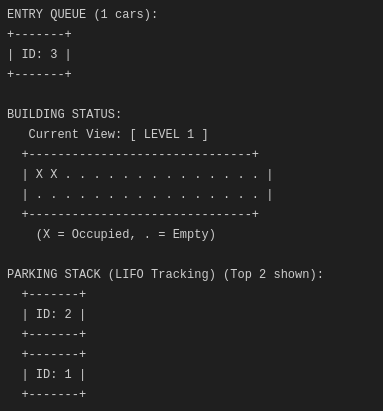

# Smart Parking System

> A high-performance, terminal-based parking management simulation written in C.


## Overview

The **Smart Parking System** is a simulation designed to demonstrate the efficient use of fundamental data structures in a real-world scenario. It manages a multi-level parking facility, handling car entry/exit queues, floor navigation, and emergency protocols, all visualized through a responsive Text User Interface (TUI).

## Key Features

- **Real-time Queue Management**: Handles peak traffic with efficient FIFO queues for entry and exit.
- **Multi-Level Navigation**: Circular linked list architecture allows seamless navigation between floors.
- **Space Optimization**: Uses bitwise operations to track 64 parking slots per floor with minimal memory overhead.
- **Emergency Protocols**: Simulates evacuation procedures using LIFO stack logic.
- **Interactive TUI**: Visualizes queues, building layout, and system logs in real-time.

## Technical Architecture

The system is built upon four core data structures:

### 1. Queue (Entry/Exit Management)

**Usage:** The Queue data structure is essential for maintaining fairness in the parking system. It follows the **First-In-First-Out (FIFO)** principle.

- **Entry Queue:** Stores cars waiting to enter. The car that arrived first is the first to be assigned a parking slot.
- **Exit Queue:** Holds cars waiting to pay and leave.

Manages the flow of cars entering and leaving the facility.

```c
typedef struct Queue {
    Car* front;
    Car* rear;
    int count;
} Queue;
```

### 2. Circular Linked List (Floor Navigation)

Connects parking levels in a loop for continuous traversal (Ground -> L1 -> L2 -> Ground).

```c
typedef struct Floor {
    int floor_number;
    uint64_t slots; // 64 bits for 64 slots
    struct Floor* next;
} Floor;
```

### 3. Stack (Emergency Tracking)

**Usage:** The Stack is used to simulate an emergency evacuation protocol. It follows the **Last-In-First-Out (LIFO)** principle.

- **Evacuation:** In an emergency, the system evacuates cars starting from the most recently parked one. This simulates a scenario where cars must be cleared in reverse order of arrival to prevent bottlenecks.

Tracks parked cars to facilitate a Last-In-First-Out (LIFO) evacuation strategy.

```c
typedef struct Stack {
    int items[MAX_FLOORS * SLOTS_PER_FLOOR];
    int top;
} Stack;
```

### 4. Bit Manipulation (Slot Tracking)

Each floor uses a single `uint64_t` integer to track 64 parking spots.

- **0**: Empty
- **1**: Occupied

**Core Logic:**

```c
// Find first available slot (0 bit)
int find_free_slot(uint64_t slots) {
    for (int i = 0; i < 64; i++) {
        if (!((slots >> i) & 1)) return i;
    }
    return -1;
}
```

## Getting Started

### Prerequisites

- GCC Compiler
- Standard Linux Terminal

### Compilation

Compile the source code using `gcc`:

```bash
gcc parking_system.c -o parking
```

### Usage

Run the executable to start the simulation:

```bash
./parking
```

## Controls

| Option | Action           | Description                                           |
| ------ | ---------------- | ----------------------------------------------------- |
| `1`    | **Add Car**      | Adds a car to the Entry Queue.                        |
| `2`    | **Park Car**     | Moves a car from Queue to the first available slot.   |
| `3`    | **Rotate View**  | Switches the visual display to the next floor.        |
| `4`    | **Request Exit** | Signals a car to leave (moves to Exit Queue).         |
| `5`    | **Pay & Exit**   | Processes payment and clears the car from the system. |
| `6`    | **Evacuate**     | Triggers emergency LIFO evacuation.                   |
| `7`    | **Quit**         | Exits the application.                                |

## Screenshots

### Core Features

**1. Queue & Parking**

_Shows the Entry Queue, Occupied Slots on Level 1, and the Parking Stack._



**2. Exit Queue & Busy Stack**

_A busy system with a full stack and a car waiting in the Exit Queue._


**3. Payment & Departure**

_Action Log showing a successful payment and exit transaction._


### Floor Navigation

**4. Occupied Floor (Level 1)**

_Level 1 partially filled with cars._


**5. Empty Floor (Level 4)**

_Level 4 completely empty, demonstrating the circular list navigation._


### Advanced Scenarios

**6. Full Row & Busy Queue**

_Stress test: A fully occupied row and a long line of cars._


**7. Level 1 Full (Overflow)**

_Level 1 reaches 100% capacity (0 slots available)._


**8. Spillover to Level 2**

_Smart logic: Car #1 is automatically assigned to Level 2 because Level 1 is full._


### Smart Slot Reuse

**9. Creating Gaps**

_Cars leave from the middle of the row, creating specific empty slots._


**10. Filling the Gap**

_New car intelligently fills the first available slot (Slot 1) instead of the end._


### Emergency

**11. Emergency Evacuation**

_System triggers LIFO evacuation, clearing the stack._


## License

This project is open-source and available under the MIT License.
